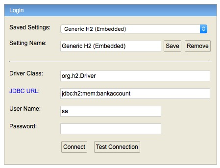
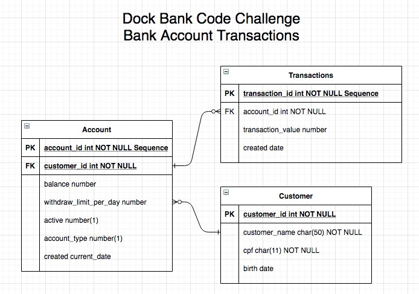

# Dock Bank Code Challenge for Bank Account
Springboot REST Full Web Service Application Code Challenge with the following features:
* creating account balance
* deposit transaction
* check account balance
* withdraw
* disable account
* bank statement

## Detailed dependencies:
* [JUnit](https://junit.org/junit5/)
* [AssertJ](https://assertj.github.io/doc/)
* [Mockito](https://site.mockito.org)
* [SpringTest](https://docs.spring.io/spring-boot/docs/1.5.2.RELEASE/reference/html/boot-features-testing.html)
* [Swagger](https://swagger.io)
* [MapStruct](https://mapstruct.org)
* [Javax Bean Validation](https://docs.oracle.com/javaee/7/tutorial/bean-validation001.htm)
* [H2 Database](https://www.h2database.com/html/main.html)

## Prerequisites
Before you begin, ensure you have met the following requirements:
* [Java 8 installation](https://docs.oracle.com/javase/8/docs/technotes/guides/install/install_overview.html)
* [Git installation](https://git-scm.com)
* [Maven installation](https://maven.apache.org/install.html)

### This web application based on:


## Running
To use Bank Account Web Application, follow these steps:

```
mvn spring-boot:run
```

## Swagger documentation
Swagger documentation and database are available when this application is running with the following link:
* [Swagger](http://localhost:8080/swagger-ui.html)
* [H2 Database](http://localhost:8080/h2-ui/) with the following information:


## Entity Relationship Diagram


## H2 Database Customer insert command
```
insert into customer (customer_id, customer_birth, customer_cpf, customer_name) values (1, PARSEDATETIME(sysdate, 'yyyy-MM-dd'), '11111111111', 'Nome do cliente');
```

## Contact

If you want to contact me you can reach me at <alexandre1202@gmail.com>.
